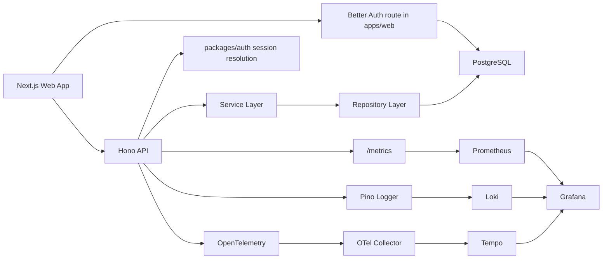

# Acme Platform Starter

Production-grade full-stack monorepo starter for modern SaaS and internal platforms.

This repository combines a Next.js frontend, a Hono API, Better Auth, shared TypeScript packages, Drizzle ORM, PostgreSQL, and a local observability stack built on Grafana, Loki, Tempo, Prometheus, and OpenTelemetry.

## What This Repo Includes

- Turborepo monorepo orchestration with pnpm
- Next.js App Router frontend in `apps/web`
- Hono Node.js API in `apps/api`
- Better Auth with database-backed sessions and organization-scoped RBAC
- Shared packages for auth, config, database, logger, contracts, observability, UI, ESLint, and TypeScript presets
- PostgreSQL with Drizzle schema and migration workflow
- Redis-backed BullMQ queues and a dedicated API worker runtime
- Resend-first auth mailer with Nodemailer SMTP fallback and local capture for development
- outgoing organization-event webhooks with signed delivery retries
- database-backed audit logging for organization access changes
- Vitest unit and integration testing
- Playwright E2E smoke coverage
- Husky and lint-staged for commit-time quality gates
- Local observability stack with Grafana, Loki, Tempo, Prometheus, and OpenTelemetry Collector
- Sentry placeholders for frontend and backend

## Technology Stack

### Monorepo and Tooling

- Node.js 22+
- pnpm
- Turborepo
- Turborepo Query CLI
- TypeScript
- ESLint
- Prettier
- Husky
- lint-staged

### Frontend

- Next.js
- React
- Tailwind CSS
- TanStack Query
- Better Auth client
- Zod

### Backend

- Hono
- Better Auth server APIs
- Zod
- Pino
- Prometheus metrics
- OpenTelemetry

### Data and Auth

- PostgreSQL
- Redis
- Drizzle ORM
- Better Auth
- Resend
- Nodemailer

### Async Platform

- BullMQ
- Railway Redis

### Observability

- Grafana
- Loki
- Tempo
- Prometheus
- OpenTelemetry Collector
- Sentry

## Architecture

### High-Level Design

- `apps/web` is the presentation layer and hosts the Better Auth route handler
- `apps/api` is the Hono transport layer for application APIs
- `packages/auth` owns Better Auth configuration, session helpers, RBAC helpers, and auth mail delivery
- `packages/shared` contains transport-neutral contracts and response types
- `packages/db` contains schema, migrations, client, and repositories
- `packages/config` owns runtime env validation
- `packages/logger` owns structured logging and Loki shipping
- `packages/observability` owns OpenTelemetry bootstrap and trace helpers
- services encapsulate business logic
- repositories encapsulate persistence logic
- route handlers stay thin and orchestrate validation, services, and response formatting

### Request Flow



## Workspace Layout

```text
apps/
  api/         Hono API service
  web/         Next.js frontend and Better Auth route handler
  web-e2e/     Playwright smoke-test placeholder

packages/
  auth/                Better Auth config, session helpers, RBAC, auth mailer
  config/              Zod-based env loaders
  db/                  Drizzle schema, migrations, repositories
  eslint-config/       Shared flat ESLint configuration
  jobs/                Redis queues, typed payloads, event fan-out helpers
  logger/              Pino logger and Loki transport
  observability/       OpenTelemetry bootstrap and helpers
  shared/              DTOs, Zod schemas, constants, response envelopes
  typescript-config/   Shared tsconfig presets
  ui/                  Shared UI primitives

infra/
  observability/
    grafana/
    loki-config.yml
    otel-collector-config.yaml
    prometheus.yml
    tempo.yaml
```

## Current Application Features

### Frontend

- public landing page
- public auth pages:
  - `/sign-in`
  - `/sign-up`
  - `/forgot-password`
  - `/reset-password`
  - `/accept-invite`
- protected pages:
  - `/users` for organization member management
  - `/health` for operational dashboards
- same-origin invitation bridge route:
  - `POST /api/invitations`
- typed API client
- TanStack Query data fetching and mutations
- Better Auth client integration
- shared UI package usage
- frontend env parsing
- Sentry placeholder wiring

### API

- versioned routes under `/api/v1`
- public routes:
  - `GET /health`
  - `GET /metrics`
- protected routes:
  - `GET /users`
  - `GET /me`
  - `GET /audit-logs`
  - `POST /invitations`
  - `POST /organizations`
  - `POST /invitations/:invitationId/accept`
  - `GET /webhooks`
  - `POST /webhooks`
  - `DELETE /webhooks/:endpointId`
- guarded operational routes:
  - `GET /logs-test`
  - `GET /error-test`
- request ID middleware
- request logging middleware
- latency measurement
- structured error handling
- credential-aware CORS
- Prometheus metrics
- authenticated request enrichment for logs, traces, and Sentry

### Auth and RBAC

- Better Auth email/password authentication
- database-backed cookie sessions
- organization plugin with default RBAC roles:
  - `owner`
  - `admin`
  - `member`
- sign-up creates the initial user account
- the first organization can be created from the protected members workspace
- owner and admin roles can invite members and admins
- password reset flow
- verification email wiring
- invitation acceptance flow

### Data Layer

- Drizzle schema generated from Better Auth configuration
- migration generation
- migration runner
- organization members repository
- pending invitations repository
- webhook endpoint and delivery repositories
- PostgreSQL-ready local setup

## Prerequisites

- Node.js 22 or newer
- pnpm enabled through Corepack
- Docker Desktop or Docker Engine with Compose

Recommended setup:

```bash
corepack enable
corepack prepare pnpm@latest --activate
```

## How This Repo Was Scaffolded

This project was created by preferring official CLIs first and then layering the shared packages manually.

```bash
corepack enable
corepack prepare pnpm@latest --activate
pnpm dlx create-turbo@latest acme-platform --package-manager pnpm --skip-install
cd acme-platform
node -e "const fs=require('node:fs'); ['apps/web','apps/docs','packages/ui'].forEach((p)=>fs.rmSync(p,{recursive:true,force:true}))"
pnpm create next-app@latest apps/web --ts --tailwind --eslint --app --use-pnpm --skip-install --yes
pnpm create hono@latest apps/api --template nodejs --pm pnpm
pnpm create playwright@latest apps/web-e2e --lang=TypeScript --quiet --no-examples --no-browsers
pnpm install
pnpm exec husky init
```

Note:

- In this environment the official Next.js Sentry wizard could not complete because it requires an interactive TTY.
- The equivalent placeholder integration files were added manually so the repo still has the correct wiring points.

## Getting Started

### 1. Install Dependencies

## Turborepo Query Commands

The installed `turbo@2.9.6` in this repo already supports the query subcommands, so you can inspect package graphs and affected workspaces without adding another dependency.

Common commands:

```bash
pnpm run query:packages
pnpm run query:packages:affected
pnpm run query:affected --packages --base=origin/main --head=HEAD
pnpm run query:affected --tasks=build --base=origin/main --head=HEAD
pnpm exec turbo query "query { packages { items { name path } } }"
```

Notes:

- Use `pnpm run query:packages` to list all workspaces in the monorepo.
- Use `pnpm run query:packages:affected` for a quick current-branch view against `main`.
- Use `pnpm run query:affected --packages` when you want explicit control over `--base` and `--head`.
- Use `pnpm run query:affected --tasks=<task>` to see which package tasks are affected instead of only package names.
- Use `pnpm exec turbo query` to run raw GraphQL queries or start the GraphiQL server when no query string is provided.

```bash
pnpm install
```

### 2. Create Environment Files

Create these files before starting the apps:

- root `.env`
- `apps/api/.env`
- `apps/web/.env`

These files are for local development only. Do not upload them to Vercel, Railway, Supabase, or GitHub.

Do not set `NODE_ENV` manually in these local `.env` files. Next.js and deployed runtimes should control `NODE_ENV` themselves.

Start from the checked-in examples:

```bash
cp .env.example .env
cp apps/api/.env.example apps/api/.env
cp apps/web/.env.example apps/web/.env
```

Windows PowerShell:

```powershell
Copy-Item .env.example .env
Copy-Item apps/api/.env.example apps/api/.env
Copy-Item apps/web/.env.example apps/web/.env
```

### 3. Set the Shared Auth Variables

These values must match anywhere they are defined:

- `BETTER_AUTH_SECRET`
- `BETTER_AUTH_URL`
- `AUTH_FROM_EMAIL`
- `RESEND_API_KEY`
- `SMTP_HOST`
- `SMTP_PORT`
- `SMTP_SECURE`
- `SMTP_USER`
- `SMTP_PASSWORD`

For local development:

- keep `BETTER_AUTH_URL=http://localhost:3000`
- use the same `BETTER_AUTH_SECRET` in both `apps/web/.env` and `apps/api/.env`
- Resend is preferred when `RESEND_API_KEY` is set
- if Resend is not configured and SMTP credentials are complete, the shared auth mailer uses Nodemailer SMTP
- if neither provider is configured, the shared auth mailer captures emails in memory outside production
- in production, at least one real provider must be configured or auth emails will fail at send time

Generate a dev secret:

```bash
openssl rand -base64 32
```

Windows PowerShell:

```powershell
[Convert]::ToBase64String((1..32 | ForEach-Object { Get-Random -Minimum 0 -Maximum 256 }))
```

### 4. Start Local Infrastructure

```bash
docker compose up -d
```

### 5. Refresh Better Auth Generated Schema

Run this whenever the Better Auth config or plugins change:

```bash
pnpm auth:generate
```

### 6. Generate or Refresh Drizzle Migration Files

```bash
pnpm db:generate
```

### 7. Apply Migrations

```bash
pnpm db:migrate
```

### 8. Start the Monorepo in Development

```bash
pnpm dev
```

## Local URLs

### Apps

- Web: `http://localhost:3000`
- API: `http://localhost:3001`
- Better Auth health check: `http://localhost:3000/api/auth/ok`
- API health: `http://localhost:3001/api/v1/health`
- API metrics: `http://localhost:3001/metrics`

### Observability

- Grafana: `http://localhost:3002`
- Prometheus: `http://localhost:9090`
- Loki API: `http://localhost:3100`
- Tempo API: `http://localhost:3200`
- OTel Collector OTLP HTTP: `http://localhost:4318`
- OTel Collector OTLP gRPC: `localhost:4317`

Important note:

- Grafana is the main UI for logs and traces
- Prometheus has its own UI
- Loki and Tempo mostly expose APIs and admin/debug endpoints, not full standalone product UIs in this local setup

## Environment Variables

### Root `.env`

Use root `.env` for local infrastructure-level settings such as Grafana credentials and other values that are not app-runtime-specific.

For deployed environments, use platform-native env stores instead of committed or copied `.env` files.

Optional local DB tooling variable:

- `DATABASE_MIGRATION_URL`
- if omitted locally, Drizzle tooling falls back to `DATABASE_URL`
- `REDIS_URL`
- `REDIS_PREFIX`
- `FEATURE_FLAGS_JSON`

### `apps/api/.env`

This file powers:

- API runtime
- database tooling scripts
- Drizzle commands
- local logging and observability configuration
- Better Auth session validation inside the Hono API

This file is a local-development input only. Railway becomes the source of truth for deployed API runtime envs.

Key variables:

- `PORT`
- `DATABASE_URL`
- `DATABASE_MIGRATION_URL`
- `REDIS_URL`
- `REDIS_PREFIX`
- `FEATURE_FLAGS_JSON`
- `APP_ORIGIN`
- `API_CORS_ORIGIN`
- `BETTER_AUTH_SECRET`
- `BETTER_AUTH_URL`
- `AUTH_FROM_EMAIL`
- `RESEND_API_KEY`
- `SMTP_HOST`
- `SMTP_PORT`
- `SMTP_SECURE`
- `SMTP_USER`
- `SMTP_PASSWORD`
- `API_SERVICE_NAME`
- `API_SENTRY_DSN`
- `API_LOG_LEVEL`
- `API_LOG_TO_LOKI`
- `OTEL_EXPORTER_OTLP_ENDPOINT`
- `LOKI_URL`

### `apps/web/.env`

This file powers:

- Next.js runtime
- Better Auth route handler mounted in `apps/web`
- auth emails and redirect URLs

This file is a local-development input only. Vercel becomes the source of truth for deployed web runtime envs.

Key variables:

- `NEXT_PUBLIC_API_BASE_URL`
- `API_UPSTREAM_URL`
- `REDIS_URL`
- `REDIS_PREFIX`
- `FEATURE_FLAGS_JSON`
- `NEXT_PUBLIC_APP_ENV`
- `NEXT_PUBLIC_SENTRY_DSN`
- `BETTER_AUTH_SECRET`
- `BETTER_AUTH_URL`
- `AUTH_FROM_EMAIL`
- `RESEND_API_KEY`
- `SMTP_HOST`
- `SMTP_PORT`
- `SMTP_SECURE`
- `SMTP_USER`
- `SMTP_PASSWORD`

## Secrets Management

Use platform-native secret stores as the source of truth for deployed environments:

- Vercel owns web runtime envs
- Railway owns API runtime envs
- Supabase owns database infrastructure, but not runtime secret distribution
- GitHub Actions owns CI and future deploy credentials only

Secret classes:

- Real secrets: `DATABASE_URL`, `DATABASE_MIGRATION_URL`, `BETTER_AUTH_SECRET`, `RESEND_API_KEY`, `SMTP_PASSWORD`, `API_SENTRY_DSN`, `NEXT_PUBLIC_SENTRY_DSN`, `REDIS_URL`
- Sensitive config: `AUTH_FROM_EMAIL`, `SMTP_USER`, `SMTP_HOST`, `SMTP_PORT`, `SMTP_SECURE`
- Environment-specific config: `BETTER_AUTH_URL`, `APP_ORIGIN`, `API_CORS_ORIGIN`, `API_UPSTREAM_URL`, `NEXT_PUBLIC_API_BASE_URL`, `NEXT_PUBLIC_APP_ENV`, `PORT`, `API_SERVICE_NAME`, `API_LOG_LEVEL`, `API_LOG_TO_LOKI`, `OTEL_EXPORTER_OTLP_ENDPOINT`, `LOKI_URL`, `REDIS_PREFIX`, `FEATURE_FLAGS_JSON`

Environment rules:

- `BETTER_AUTH_SECRET` must match between web and API within one environment
- `BETTER_AUTH_SECRET` must differ across preview, staging, and production
- preview must never reuse production DB, auth, or email secrets
- local `.env` files are never the source of truth for deployed environments
- GitHub CI remains synthetic and fork-safe by default

Rotation rules:

- rotate DB credentials if they were shared in chat, screenshots, logs, or ad-hoc notes
- rotate `BETTER_AUTH_SECRET` if the same value was reused across environments during setup
- rotate `RESEND_API_KEY` or `SMTP_PASSWORD` if they were ever exposed outside the platform secret stores
- update platform envs first, redeploy affected services second, then verify auth, invites, and protected routes

Detailed runbook:

- [docs/operations/secrets-management.md](./docs/operations/secrets-management.md)

## Database Environments

Use this database model:

- local development uses Docker Postgres
- preview reuses the staging Supabase project
- staging and production use separate Supabase projects
- runtime traffic uses `DATABASE_URL`
- Drizzle generation and migration tooling uses `DATABASE_MIGRATION_URL` when present, otherwise it falls back to `DATABASE_URL`

Connection strategy:

- Vercel web should use a Supabase transaction pooler URL for runtime `DATABASE_URL`
- Railway API may use a working pooled or direct runtime `DATABASE_URL`
- protected GitHub Actions migration workflows should use `DATABASE_MIGRATION_URL`
- for GitHub-hosted runners, prefer the Supabase session pooler URL on port `5432` for `DATABASE_MIGRATION_URL`

Migration promotion:

- generate migrations locally
- let CI verify committed migrations on ephemeral Postgres
- run staging migrations first through a manual GitHub workflow
- verify staging flows
- run production migrations through the same protected workflow after approval

Database environment runbook:

- [docs/operations/database-environments.md](./docs/operations/database-environments.md)

## Async Platform

Use this async model:

- Railway Redis is the shared async backbone in deployed environments
- `apps/api` exposes the HTTP service
- `apps/api` also exposes a dedicated worker entrypoint for BullMQ consumers
- Better Auth invitation email delivery uses the queue when Redis-backed async delivery is enabled
- successful organization access changes can fan out signed outgoing webhooks after audit persistence

Feature flags:

- `asyncInviteEmail`
- `outgoingWebhooks`

Async platform runbook:

- [docs/operations/async-platform.md](./docs/operations/async-platform.md)

## Scripts

### Root Scripts

```bash
pnpm dev
pnpm build
pnpm start
pnpm lint
pnpm format
pnpm format:check
pnpm typecheck
pnpm test
pnpm test:e2e
pnpm auth:generate
pnpm db:generate
pnpm db:migrate
pnpm db:studio
pnpm --filter @acme/api worker
```

## Continuous Integration

GitHub Actions is the default CI provider for this repo.

### Workflow

The main workflow is:

- `.github/workflows/ci.yml`
- `.github/workflows/database-migrate.yml`

It runs on:

- pull requests targeting `main`
- pushes to `main`
- manual `workflow_dispatch`

### Required PR Checks

These jobs are intended to be required in branch protection:

- `format-check`
- `lint`
- `typecheck`
- `test`
- `build`
- `docker-validate`
- `e2e-smoke`

### Main-Only Verification

The heavier `db-verify` job runs on:

- pushes to `main`
- manual workflow dispatches

It verifies:

- Better Auth generated schema stays committed
- Drizzle SQL artifacts stay committed
- migrations apply on a fresh PostgreSQL service

The `async-verify` job runs on the same trigger set and verifies:

- Redis-backed queue wiring
- async domain-event fan-out helpers

### CI Environment Strategy

CI does not depend on committed local `.env` files or production secrets.

GitHub Actions should only hold CI and future deployment credentials, not app runtime production secrets.

Protected database migrations use GitHub Environment secrets:

- `staging` environment stores `DATABASE_MIGRATION_URL`
- `production` environment stores `DATABASE_MIGRATION_URL` and should require approval before execution

- `.github/actions/write-ci-env` generates deterministic `apps/api/.env` and `apps/web/.env`
- pull request jobs use synthetic auth, mailer, and app env values
- only `db-verify` depends on a live PostgreSQL service container

### Useful Filtered Commands

Run only the API:

```bash
pnpm --filter @acme/api dev
```

Run only the web app:

```bash
pnpm --filter @acme/web dev
```

Run only auth package tests:

```bash
pnpm --filter @acme/auth test
```

Run only API tests:

```bash
pnpm --filter @acme/api test
```

Run only web E2E tests:

```bash
pnpm --filter @acme/web-e2e test:e2e
```

## Authentication Workflow

### Public Pages

- `/`
- `/sign-in`
- `/sign-up`
- `/forgot-password`
- `/reset-password`
- `/accept-invite`

### Protected Pages

- `/users`
- `/health`

Route protection is layered:

- `proxy.ts` performs optimistic cookie-based redirects for faster navigation
- protected server components validate the real session on the server
- Hono routes re-validate session and role on every request

### Sign-Up and Organization Bootstrap

- sign-up creates the user account with Better Auth
- invited sign-ups redirect into the invitation acceptance flow
- non-invited users can create the first organization from `/users`
- once an organization exists, `/users` becomes the organization members workspace

### Invitation Flow

1. owner or admin opens `/users`
2. owner or admin submits the invite form
3. Better Auth creates the invitation
4. when Redis-backed async delivery is enabled, invitation email delivery is queued and handled by the API worker
5. if async delivery is disabled, the shared mailer sends through Resend or SMTP inline
6. if neither provider is configured outside production, the mailer falls back to in-memory capture so local flows do not hard-fail
7. the invited user opens `/accept-invite?invitationId=...`
8. after sign-in or sign-up, the user accepts the invitation and joins the organization

### Password Reset Flow

1. open `/forgot-password`
2. submit the account email
3. Better Auth generates the reset link
4. the shared mailer sends through Resend or SMTP, or captures locally when neither provider is configured outside production
5. open `/reset-password?token=...`
6. submit the new password

## Database Workflow

### Refresh Better Auth Schema

```bash
pnpm auth:generate
```

### Generate a Migration

```bash
pnpm db:generate
```

### Apply Migrations

```bash
pnpm db:migrate
```

### Open Drizzle Studio

```bash
pnpm db:studio
```

### Database Notes

- Docker Postgres is exposed on host port `5433`
- port `5433` is used intentionally to avoid conflicts with local PostgreSQL installs on `5432`
- the root DB scripts use `apps/api/.env`
- the Better Auth CLI generates schema into `packages/db/src/schema/auth.ts`
- Drizzle SQL migrations remain the source of truth for applied schema changes

### Running Multiple Local Copies

- Compose service containers no longer use fixed global `container_name` values, so separate starter directories can coexist without Docker name collisions.
- If you want multiple local stacks running at the same time, give each project unique host port values in the root `.env` file:
  `POSTGRES_PORT`, `REDIS_PORT`, `LOKI_PORT`, `TEMPO_PORT`, `OTEL_GRPC_PORT`, `OTEL_HTTP_PORT`, `OTEL_METRICS_PORT`, `PROMETHEUS_PORT`, and `GRAFANA_PORT`.
- If two local copies happen to share the same folder name, set `COMPOSE_PROJECT_NAME` in the root `.env` of one copy so Docker Compose namespaces the stack differently.
- After changing those Compose host ports, update the matching `localhost` URLs in `apps/api/.env` and `apps/web/.env` so the app talks to the correct local infrastructure.

## API Design Conventions

- all public routes are versioned under `/api/v1`
- route handlers validate request input with Zod
- route handlers delegate to services
- services delegate to repositories
- persistence stays inside `packages/db`
- responses use shared envelope types from `@acme/shared`
- logging and request metadata are applied centrally through middleware
- authenticated routes enrich logs, traces, and Sentry tags with user and organization metadata

## Frontend Design Conventions

- App Router everywhere
- Better Auth route handling stays in `apps/web`
- API access goes through typed client utilities and query hooks
- TanStack Query owns server-state lifecycle
- shared contracts come from `@acme/shared`
- shared UI primitives come from `@acme/ui`

## Logging, Metrics, and Tracing

### Logs

- API logs are emitted through `@acme/logger`
- development logs are pretty-printed in the terminal
- Loki shipping is opt-in through `API_LOG_TO_LOKI=true`
- authenticated requests include `userId`, `organizationId`, and `role`
- Grafana is the preferred log viewer

### Metrics

- the API exposes Prometheus metrics at `/metrics`
- Prometheus scrapes the API and the OTel Collector
- Tempo metrics-generator remote-writes span metrics into Prometheus

Useful Prometheus queries:

```promql
up
```

```promql
sum by (route, status_code) (rate(acme_api_http_requests_total[5m]))
```

```promql
histogram_quantile(0.95, sum by (le) (rate(acme_api_http_request_duration_ms_bucket[5m])))
```

```promql
sum by (service) (rate(traces_spanmetrics_calls_total[5m]))
```

### Traces

- API spans are exported to the OTel Collector
- the collector forwards traces into Tempo
- Grafana Explore is the preferred trace UI
- authenticated requests attach session-aware span attributes without logging secrets
- TraceQL metrics work locally because Tempo metrics-generator has:
  - an active ring member
  - local-blocks enabled
  - durable generator WAL and traces paths
  - remote-write configured to Prometheus

## Grafana Usage

### Log Exploration

1. Open Grafana at `http://localhost:3002`
2. Go to `Explore`
3. Select the `Loki` datasource
4. Run:

```logql
{service="acme-api", environment="development"}
```

Useful filters:

```logql
{service="acme-api", environment="development"} |= "request completed"
```

```logql
{service="acme-api", environment="development"} |= "/api/v1/invitations"
```

### Trace Exploration

1. Open `Explore`
2. Select the `Tempo` datasource
3. Search for recent traces or use TraceQL

Examples:

```traceql
{}
```

```traceql
{ resource.service.name = "acme-api" }
```

### Dashboards

Grafana datasources and starter dashboards are provisioned automatically from:

- `infra/observability/grafana/provisioning/datasources`
- `infra/observability/grafana/provisioning/dashboards`

## Prometheus Usage

Prometheus has a simple built-in UI at `http://localhost:9090`.

Start with these queries:

```promql
up
```

```promql
up{job="acme-api"}
```

```promql
up{job="otel-collector"}
```

```promql
rate(acme_api_http_requests_total[5m])
```

## Sentry

Sentry is wired as a safe placeholder.

### Backend

- DSN variable: `API_SENTRY_DSN`
- SDK: `@sentry/node`
- enabled only when a DSN exists and `NODE_ENV` is not `development`
- authenticated requests enrich Sentry scope with user and organization tags

### Frontend

- DSN variable: `NEXT_PUBLIC_SENTRY_DSN`
- Next.js instrumentation files are already present
- frontend capture is gated for production-style usage

Recommended setup:

- create one Sentry project for `web`
- create one Sentry project for `api`
- use separate DSNs for cleaner issue separation

## Testing

### Included

- unit tests for shared packages
- auth env validation tests
- auth RBAC helper tests
- logger tests
- API integration tests using `app.request()`
- Playwright smoke coverage

### Commands

```bash
pnpm test
pnpm test:e2e
```

## Docker Services

The Compose stack includes:

- PostgreSQL
- Redis
- Loki
- Tempo
- OpenTelemetry Collector
- Prometheus
- Grafana

Bring the stack up:

```bash
docker compose up -d
```

Recreate observability services after config changes:

```bash
docker compose up -d --force-recreate tempo otel-collector prometheus grafana loki
```

## Troubleshooting

### `GET /api/auth/ok` fails

Check:

- `BETTER_AUTH_SECRET` is present and at least 32 characters
- `BETTER_AUTH_URL=http://localhost:3000` in local development
- both `apps/web/.env` and `apps/api/.env` contain matching Better Auth values

### The API says `DATABASE_URL` is missing during `pnpm dev`

The API process reads `apps/api/.env`. Make sure `DATABASE_URL` is present there before starting the Hono server.

### Sign-in works but protected API calls fail

Check:

- `APP_ORIGIN=http://localhost:3000`
- `API_CORS_ORIGIN=http://localhost:3000`
- frontend requests include credentials
- the browser actually has a Better Auth session cookie

### Grafana shows no API logs

Check:

- `API_LOG_TO_LOKI=true` in `apps/api/.env`
- API process restarted after env changes
- Loki datasource works in Grafana Explore

### Tempo TraceQL metrics return 500 or `empty ring`

This was caused locally by an incomplete Tempo metrics-generator config.

The current config already fixes this by enabling:

- `metrics_generator.ring.instance_port`
- generator WAL and traces storage
- `local-blocks`
- Prometheus remote-write

If you change `tempo.yaml`, recreate:

```bash
docker compose up -d --force-recreate tempo prometheus grafana
```

### Prometheus target for `otel-collector` is down

The collector now exposes telemetry metrics on `:8889`.

If it becomes stale after config changes:

```bash
docker compose up -d --force-recreate otel-collector prometheus
```

### `db:generate` says `Invalid URL`

- make sure `DATABASE_URL` is in `apps/api/.env`
- make sure it is a valid URL
- URL-encode passwords if they contain reserved characters

### `db:migrate` fails in GitHub Actions with `ENETUNREACH`

- check the `DATABASE_MIGRATION_URL` secret in the selected GitHub Environment
- if it points at a Supabase direct host like `db.<project>.supabase.co`, switch it to the Supabase session pooler URL on port `5432`
- keep transaction pooler URLs for runtime traffic, not GitHub migration workflows

### API starts but health page hangs

- make sure the API is actually running on `3001`
- check `apps/api/.env`
- inspect terminal logs with:

```bash
pnpm --filter @acme/api dev
```

### Queue-backed invites or webhooks are not processing

Check:

- `REDIS_URL` is set for the service running the worker
- the worker process is deployed with `pnpm --filter @acme/api worker`
- `FEATURE_FLAGS_JSON` is not explicitly disabling `asyncInviteEmail` or `outgoingWebhooks`
- Railway Redis and the worker share the same private network

## Platform Status

The core platform roadmap in this starter now includes:

- managed database environments
- production secrets management
- audit logging
- Redis-backed background jobs
- outgoing webhooks
- internal feature flags

Likely next expansion ideas:

- incoming webhook handlers
- webhook management UI
- additional queued jobs beyond invitation delivery
- external or operator-facing feature flag management

## Releasing the Starter

This repo can publish the scaffold package as [`create-acme-platform`](https://www.npmjs.com/package/create-acme-platform).

Release locally with one of:

```bash
pnpm release:patch
pnpm release:minor
pnpm release:major
```

Useful validation commands:

```bash
pnpm release:build-package
pnpm release:verify
pnpm release:pack:dry-run
```

Typical release flow:

1. run the appropriate `pnpm release:*` command
2. review the generated `CHANGELOG.md`, version bump, commit, and `vX.Y.Z` tag
3. push the release commit and tag with `git push --follow-tags`
4. let GitHub Actions publish `dist/create-acme-platform`

Authentication options for publishing:

- configure a `Production` environment secret named `NPM_TOKEN` with a write token that can publish under your npm 2FA policy
- or configure npm Trusted Publishing for this repository and workflow file (`release.yml`) and publish through GitHub OIDC without a long-lived token

## License

MIT
